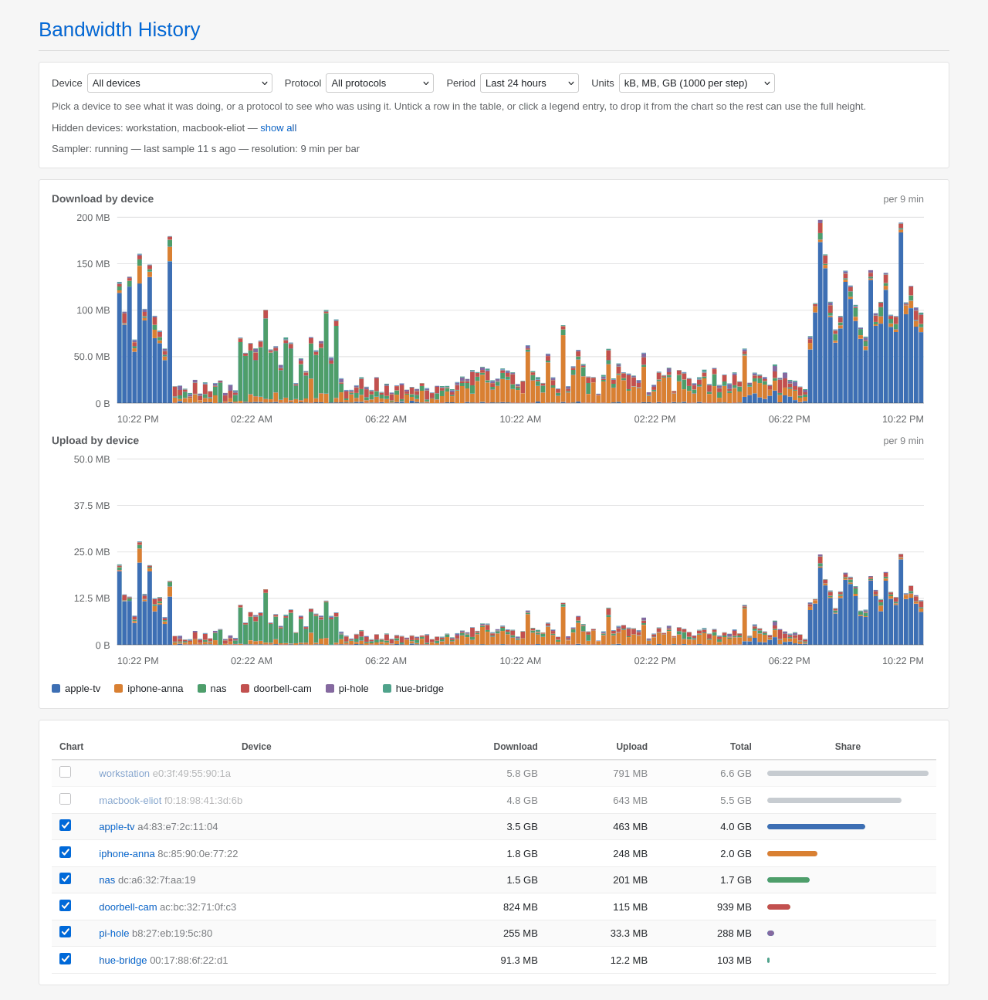

# luci-app-nlbw-history 1.0.12

Per-device bandwidth graphs for OpenWrt, under **Services → Bandwidth
History**, with a *History* tab, a *Live* tab and a *Settings* tab.

It measures nothing itself. History samples the counters `nlbwmon` already
keeps and stores the difference; the Live tab reads conntrack directly and
stores nothing. No packet inspection, no firewall rules, and no effect on
software or hardware flow offloading.

## History

Every device stacked, so you can see who was using the line at any moment.
Two dropdowns change what is stacked, and clicking a name in the table sets
the same filter:

- nothing selected: one band per device
- a device selected: one band per protocol, so you can see what it was doing
- a protocol selected: one band per device, so you can see who was using it

One device can pull a hundred times what the rest of the house does, which
flattens everything else onto the baseline. Untick it in the **Chart** column,
or click its legend entry, and it drops out so the rest can use the full
height. The table keeps listing it, greyed out, with its real totals. The
choice is remembered in the browser; **show all** clears it.

The period dropdown holds relative windows up to 30 days, then one entry per
calendar month that retention can still reach.

## Live

What is moving *right now*. Reads conntrack instead of nlbwmon, stores nothing,
and samples only while the page is open.

The same two filters work here, plus a **Units** dropdown that switches the
rates between bits and bytes per second. Protocols are named by destination
port, so anything on 443 reads as HTTPS whatever is actually inside it.

Bars default to 3 seconds because that is roughly how often the kernel folds
hardware-offloaded counters back into conntrack. Finer bars need that made
faster too:

    sysctl -w net.netfilter.nf_conntrack_tcp_timeout_offload=10

It also needs byte counters in conntrack, which the page tells you about if
they are missing:

    sysctl -w net.netfilter.nf_conntrack_acct=1

This tab is not accounting. A connection that opens and closes between two
samples is never seen, which is why History keeps using nlbwmon.

## What gets counted is nlbwmon's decision

Both tabs count the traffic nlbwmon is configured to count, and nothing in
**Settings** here changes that:

- **Which traffic.** A flow counts only when exactly one end is inside
  nlbwmon's `local_network` list. LAN to LAN, and anything to the router
  itself, never appears. A device that never shows up is usually on a network
  nlbwmon was not told about.
- **Protocol names.** *HTTPS*, *QUIC*, *SMB* come from nlbwmon's protocol
  list, so a name you expect, or an *unknown* you do not, is a question for
  nlbwmon.
- **Counter resets.** nlbwmon rolls over to a new accounting period; stored
  history is unaffected and survives the rollover.

Change it in `/etc/config/nlbwmon`, or through `luci-app-nlbwmon` if you have
it, then `/etc/init.d/nlbwmon restart`. It applies from the next sample on and
does not rewrite history, so a graph can straddle the change.

## Requirements

`nlbwmon` and `rpcd-mod-ucode`:

    apk add nlbwmon rpcd-mod-ucode      # OpenWrt 25.12 and newer
    opkg install nlbwmon rpcd-mod-ucode # 24.10 and older

Developed and verified on 24.10. Nothing here is version specific, but it has
not been run on 25.12 hardware.

## Install

**The prebuilt package**, from [Releases](../../releases). Both are
architecture independent, so the same file works on any target:

    # OpenWrt 25.12 and newer
    scp luci-app-nlbw-history-1.0.12-r1.apk root@192.168.1.1:/tmp/
    ssh root@192.168.1.1 'apk add --allow-untrusted /tmp/luci-app-nlbw-history-1.0.12-r1.apk'

    # 24.10 and older
    scp luci-app-nlbw-history_1.0.12-1_all.ipk root@192.168.1.1:/tmp/
    ssh root@192.168.1.1 'opkg install /tmp/luci-app-nlbw-history_1.0.12-1_all.ipk'

**Without a package manager**, copy the source tree to the router and run
`install.sh` on it; `install.sh --remove` undoes it:

    scp -r luci-app-nlbw-history-src root@192.168.1.1:/tmp/
    ssh root@192.168.1.1 'sh /tmp/luci-app-nlbw-history-src/install.sh'

**With the OpenWrt SDK**, copy `package/luci-app-nlbw-history` in, select it
under LuCI → Applications, then `make package/luci-app-nlbw-history/compile`.

Either way, check it came up:

    nlbw-history-collect --status

## Configuration

Everything is under **Services → Bandwidth History → Settings**, which also
shows whether the sampler is alive, when it last ran, how much history is on
disk and which local networks are counted. The same options live in
`/etc/config/nlbw-history`:

| option | default | meaning |
| --- | --- | --- |
| `period` | `60` | seconds between samples; this is your graph resolution |
| `retention` | `30` | days of history to keep |
| `flush_interval` | `600` | how often the RAM buffer is written to `data_dir` |
| `data_dir` | `/srv/nlbw-history` | where history is stored; **must be persistent** |
| `protocols` | `1` | also record per-protocol traffic |
| `protocol_interval` | `900` | seconds per stored protocol bucket |
| `max_rate` | `10000` | Mbit/s; samples implying more are discarded, `0` disables |
| `live_interval` | `3` | seconds per bar on the Live tab |
| `live_window` | `180` | seconds of live history kept in RAM |
| `time_format` | `auto` | clock on the graphs: `auto`, `24` or `12` |
| `date_format` | `auto` | date order: `auto`, `dmy` or `mdy` |

    uci set nlbw-history.main.period='30'
    uci commit nlbw-history
    /etc/init.d/nlbw-history reload

Expect roughly 5–10 MB per month at `period=60` with 20 busy devices, and
about the same again for protocol data. Point `data_dir` at an NVMe or USB
disk if you have one. Samples are buffered in `/tmp` and written out every
`flush_interval`, so a hard power cut loses at most that much.

## Troubleshooting

**The sampler is not running**

    /etc/init.d/nlbw-history status
    logread -e nlbw-history
    ubus call service list '{"name":"nlbw-history"}'

If procd does not know the service, the init script is not enabled. If it
starts and dies, run one sample by hand: `sh -x /usr/bin/nlbw-history-collect
2>&1 | tail -30`.

**nlbwmon returns nothing**

    /etc/init.d/nlbwmon status
    nlbw -c csv -g mac -q -n | head

That must print a header and one row per device. A device missing there is
missing from nlbwmon's accounting, not from this package.

**A bar is impossibly tall**

A bar claiming more than the link could carry is a counter glitch, not
traffic. New samples are checked against `max_rate`; history recorded before
that is checked on demand, or with **Check for implausible rows** in Settings:

    nlbw-history-collect --scrub             # report, change nothing
    nlbw-history-collect --scrub --apply     # move those rows out

Rejected rows move to `<data_dir>/YYYY-MM-DD.suspect.tsv` rather than being
deleted, and the graphs say how many samples are missing and when.

**The LuCI page is missing from the menu**

    rm -rf /tmp/luci-indexcache /tmp/luci-indexcache.* /tmp/luci-modulecache
    /etc/init.d/rpcd restart

Then log out of LuCI and back in: a stale session hides a freshly installed
page.

**The page is there but empty or erroring**

    ls /usr/lib/rpcd/ucode.so                 # rpcd-mod-ucode installed?
    ubus list | grep luci_nlbw                # backend registered?
    ubus call luci_nlbw_history status '{}'
    logread -e rpcd

If ubus works but the browser does not, open the browser console: a LuCI view
that throws leaves the page blank. The two backends also run on their own,
which separates a data problem from a display one:

    nlbw-history-query 24 20
    nlbw-history-live --status

## Installed files

    /etc/config/nlbw-history                                 configuration
    /etc/init.d/nlbw-history                                 procd service
    /usr/bin/nlbw-history-loop                               sampling loop
    /usr/bin/nlbw-history-collect                            one sample, flush, status, scrub
    /usr/bin/nlbw-history-query                              aggregation into JSON
    /usr/bin/nlbw-history-live                               live view, reads conntrack
    /usr/share/rpcd/ucode/luci.nlbw_history.uc               ubus backend
    /usr/share/rpcd/acl.d/luci-app-nlbw-history.json         ACL
    /usr/share/luci/menu.d/luci-app-nlbw-history.json        menu entry
    /www/luci-static/resources/nlbw-history/chart.js         palette, formatting, the chart
    /www/luci-static/resources/view/nlbw-history/history.js  the history page
    /www/luci-static/resources/view/nlbw-history/live.js     the live page
    /www/luci-static/resources/view/nlbw-history/settings.js the settings page
    <data_dir>/YYYY-MM-DD.tsv                                epoch, mac, rx, tx
    <data_dir>/YYYY-MM-DD.proto.tsv                          epoch, mac, protocol, rx, tx
    <data_dir>/YYYY-MM-DD.suspect.tsv                        rejected rows

Working on it rather than running it? [DEVELOPMENT.md](DEVELOPMENT.md) has the
build, the CI, the release procedure and why the code is shaped the way it is.

## How this was written

Claude, Anthropic's coding agent, wrote this package: the samplers, the ucode
backend, the LuCI views, the build scripts and this README. The screenshots are
the real page rendered against synthetic traffic, so the device names and
numbers in them are invented. The maintainer set the direction, reviewed the
result and runs it on the target hardware.

None of that changes what you should do before installing a package from a
stranger on a router you care about: read the scripts. They are deliberately
short, and there are only five of them.
