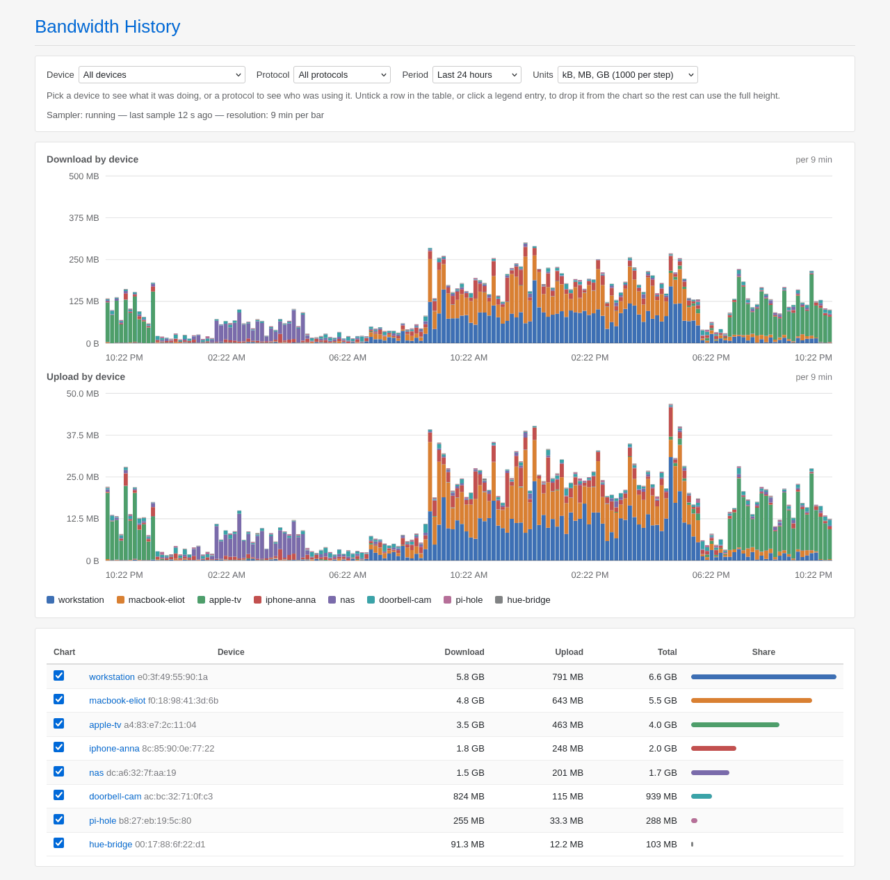
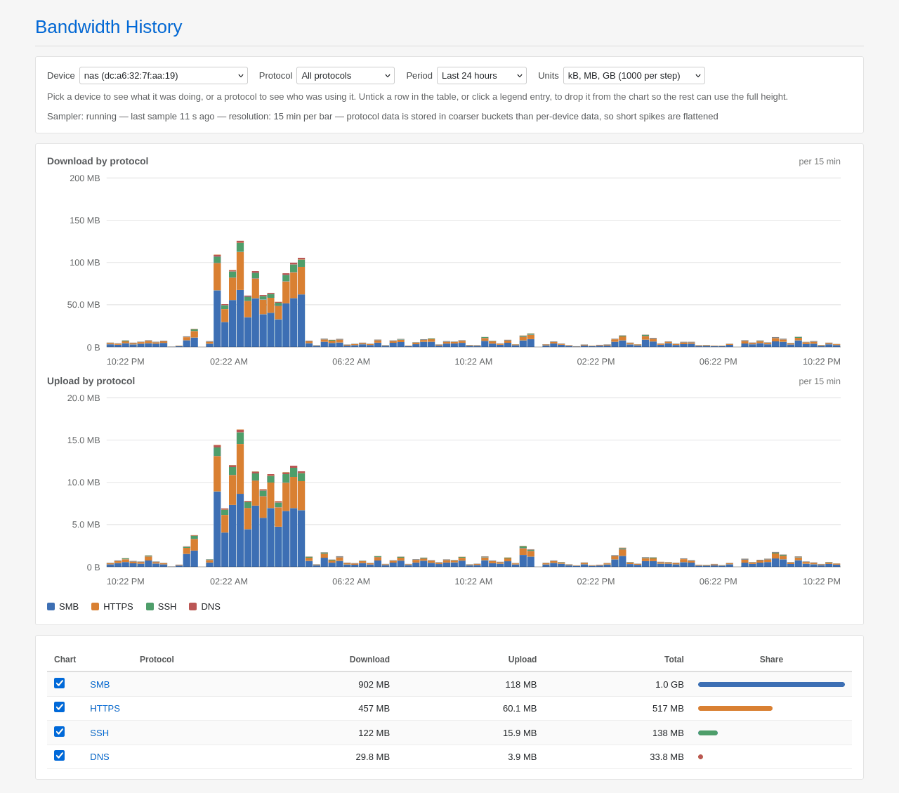

# luci-app-nlbw-history 1.0.0

Historical per-device bandwidth graphs for OpenWrt, built on the counters
`nlbwmon` already collects. It samples nlbwmon on a timer, stores the delta
between samples, and draws it in LuCI under **Services → Bandwidth History**, with a *Graphs* tab and a *Settings* tab.

It only talks to nlbwmon over its control socket. No packet inspection, no
firewall rules, no effect on software or hardware flow offloading.

The page shows every device stacked, so you can see who was using the line at
any moment. Two filters change what gets stacked:

- nothing selected: one band per device, at full sampling resolution
- a device selected: one band per protocol, so you can see what that device
  was actually doing
- a protocol selected: one band per device, so you can see who was using it

Either filter can also be set by clicking a row in the table underneath.

One device can easily pull a hundred times what the rest of the house does,
and a stacked chart scaled to it flattens everything else onto the baseline.
Untick that device in the **Chart** column of the table, or click its entry in
the legend, and it drops out of the graph so the remaining bands can use the
full height. Hidden series are dropped before the top eight are picked, so
hiding the biggest one also brings a further device up out of *Other*. The
table keeps listing them, greyed out, with their real totals: it reports what
was recorded, not what is drawn. The choice is remembered in the browser, per
device and, when a device is selected, per protocol; **show all** above the
graph clears it.

The period dropdown holds the usual relative windows, up to the last 30 days,
and below them one entry per calendar month that retention can still reach. A
long history is therefore read a month at a time: the window never gets wider
than about a month, which is what keeps a query affordable on a router.

Working on it rather than running it? See [DEVELOPMENT.md](DEVELOPMENT.md)
for the build, the CI and the release procedure.

## What gets counted is nlbwmon's decision

This package measures nothing. It reads the counters `nlbwmon` already keeps,
stores the difference between two readings, and draws it. Everything about
*what* is in those counters therefore comes from nlbwmon's own configuration,
not from anything here:

- **which traffic is accounted at all.** nlbwmon has a list of local networks,
  and it records a flow only when exactly one of its two endpoints is inside
  them. Traffic with both endpoints local is skipped, so LAN to guest, or a
  device talking to the router itself, never appears here. Traffic to anything
  outside those networks does appear, multicast and broadcast included.
- **which interfaces and subnets those are.** A device that never shows up in
  the graphs is usually on a network nlbwmon was not told about.
- **the protocol names.** *HTTPS*, *QUIC*, *SMB* and the rest are nlbwmon's
  layer 7 classification, from its own protocol list. This page only stacks
  what it is handed, so a protocol you expect to see is a question for
  nlbwmon, and so is one you see named *unknown*.
- **when the counters reset.** nlbwmon keeps an accounting period and rolls
  over to a new one; the sampler treats a counter going backwards as a reset
  and counts the new value as the traffic since. History already stored is
  unaffected, so the graphs survive a rollover that the nlbwmon page itself
  will show as a fresh start.

All of that is changed on nlbwmon's side, through its own LuCI page if
`luci-app-nlbwmon` is installed, or in `/etc/config/nlbwmon`, followed by
`/etc/init.d/nlbwmon restart`. Nothing in **Bandwidth History → Settings**
changes what is accounted: those options only decide how often this package
reads the counters and how long it keeps what it read.

Changing nlbwmon's configuration does not rewrite history either. It applies
from the next sample on, so a graph can straddle a change, showing devices or
protocols on one side of it that are absent on the other.

## Requirements

`nlbwmon` and `rpcd-mod-ucode`:

    opkg install nlbwmon rpcd-mod-ucode

## Install

**Option A: the prebuilt package.** Download
`luci-app-nlbw-history_<version>_all.ipk` from the
[Releases](../../releases) page. It is architecture independent, so the same
file works on any target:

    scp luci-app-nlbw-history_1.0.0-2_all.ipk root@192.168.1.1:/tmp/
    ssh root@192.168.1.1 'opkg install /tmp/luci-app-nlbw-history_1.0.0-2_all.ipk'

**Option B: no package manager.** Copy the source tree to the router and run
`install.sh` on it:

    scp -r luci-app-nlbw-history-src root@192.168.1.1:/tmp/
    ssh root@192.168.1.1 'sh /tmp/luci-app-nlbw-history-src/install.sh'

`install.sh --remove` undoes it.

**Option C: OpenWrt SDK.** Copy `package/luci-app-nlbw-history` into the SDK,
select it in `make menuconfig` under LuCI → Applications, then
`make package/luci-app-nlbw-history/compile V=s`.

Either way, check it came up:

    nlbw-history-collect --status

## Configuration

Everything is editable under **Services → Bandwidth History → Settings**, which
also shows whether the sampler is alive, when it last ran and how much history
is on disk. Save & Apply reloads the service for you.

The last two options are display only: `auto` leaves the clock and the date
order to whatever browser the page is open in, which is usually right, and the
other values override it for everyone looking at this router.

The same options live in `/etc/config/nlbw-history` if you prefer the shell:

| option | default | meaning |
| --- | --- | --- |
| `period` | `60` | seconds between samples; this is your graph resolution |
| `retention` | `30` | days of history to keep; browsed a month at a time |
| `flush_interval` | `600` | how often the RAM buffer is written to `data_dir` |
| `data_dir` | `/srv/nlbw-history` | where history is stored; **must be persistent** |
| `protocols` | `1` | also record per-protocol traffic |
| `protocol_interval` | `900` | seconds per stored protocol bucket |
| `time_format` | `auto` | clock on the graphs: `auto`, `24` or `12` |
| `date_format` | `auto` | date order on the graphs: `auto`, `dmy` or `mdy` |

    uci set nlbw-history.main.period='30'
    uci commit nlbw-history
    /etc/init.d/nlbw-history reload

Samples are buffered in `/tmp` and written out every `flush_interval`, so the
router touches storage six times an hour rather than once a minute. At most
`flush_interval` seconds of history is lost in a hard power cut; a normal
reboot or service stop flushes first. The LuCI page reads the buffer too, so
recent samples show up immediately.

If you have an NVMe or USB disk mounted, point `data_dir` at it:

    uci set nlbw-history.main.data_dir='/mnt/nvme/nlbw-history'

Expect roughly 5–10 MB per month at `period=60` with 20 busy devices. Only
devices with traffic in an interval get a row, so idle devices cost nothing.

Protocol data is stored separately and aggregated into `protocol_interval`
buckets, because a row per device *per protocol* per sample would be an order
of magnitude more data. At the 15 minute default it costs roughly the same
again as the per-device stream. Protocol graphs can't show detail finer than
that bucket, which the page tells you when a protocol view is on screen. Set
`protocols` to `0` to skip the whole thing.

## Troubleshooting

Work down this list; each step tells you which layer is broken.

**The sampler is not running**

    /etc/init.d/nlbw-history status      # the diagnostic dump
    ps w | grep nlbw-history-loop
    logread -e nlbw-history
    ubus call service list '{"name":"nlbw-history"}'

If procd doesn't know the service at all, the init script isn't executable or
isn't enabled: `chmod +x /etc/init.d/nlbw-history && /etc/init.d/nlbw-history
enable && /etc/init.d/nlbw-history start`.

If it starts and dies, run one sample by hand and read the error:

    sh -x /usr/bin/nlbw-history-collect 2>&1 | tail -30

**nlbwmon returns nothing**

    /etc/init.d/nlbwmon status
    nlbw -c csv -g mac -q -n | head

That must print a header line and then one tab separated row per device. If it
errors, nlbwmon isn't running or its socket is missing, and nothing downstream
can work.

If it runs but a device you expect is missing from that output, the device is
missing from nlbwmon's accounting, not from this package: see
[What gets counted is nlbwmon's decision](#what-gets-counted-is-nlbwmons-decision).

**The LuCI page is missing from the menu**

    ls /www/luci-static/resources/view/nlbw-history/main.js
    ls /usr/share/luci/menu.d/luci-app-nlbw-history.json
    rm -rf /tmp/luci-indexcache /tmp/luci-indexcache.* /tmp/luci-modulecache
    /etc/init.d/rpcd restart
    /etc/init.d/uhttpd restart

Then log out of LuCI and back in: the menu and the ACL list are resolved when
your session is created, so a stale session hides a freshly installed page.

**The page is there but empty or erroring**

    ls /usr/lib/rpcd/ucode.so                 # rpcd-mod-ucode installed?
    ubus list | grep luci_nlbw                # backend registered?
    ubus call luci_nlbw_history status '{}'
    ubus call luci_nlbw_history series '{"hours":24}'
    logread -e rpcd

If `ubus list` doesn't show the object, rpcd failed to load the ucode script
and `logread -e rpcd` will say why. If ubus works but the browser doesn't,
open the browser console: a LuCI view that throws leaves the page blank.

The aggregation is also runnable on its own, which is the quickest way to see
whether the problem is the data or the display:

    nlbw-history-query 24 20

Its full argument list is `<hours> [buckets] [mac] [protocol] [end] [hide]`,
where `hide` is the comma separated list of MACs, or of protocol names, that
the graph is leaving out.

## Installed files

    /etc/config/nlbw-history                                 configuration
    /etc/init.d/nlbw-history                                 procd service
    /usr/bin/nlbw-history-loop                               sampling loop
    /usr/bin/nlbw-history-collect                            one sample, flush, status
    /usr/bin/nlbw-history-query                              aggregation into JSON
    /usr/share/rpcd/ucode/luci.nlbw_history.uc               ubus backend
    /usr/share/rpcd/acl.d/luci-app-nlbw-history.json         ACL
    /usr/share/luci/menu.d/luci-app-nlbw-history.json        menu entry
    /www/luci-static/resources/view/nlbw-history/main.js     the graphs page
    /www/luci-static/resources/view/nlbw-history/settings.js the settings page
    <data_dir>/YYYY-MM-DD.tsv                                history: epoch, mac, rx, tx
    <data_dir>/YYYY-MM-DD.proto.tsv                          history: epoch, mac, protocol, rx, tx

## How this was written

Claude, Anthropic's coding agent, wrote this package: the samplers, the ucode
backend, the LuCI views, the build script and this README. The screenshots
above are the real page rendered against synthetic traffic rather than grabs
from a live router, so the device names and the numbers in them are invented. The maintainer set
the direction, reviewed the result and runs it on the target hardware.

`CLAUDE.md` in the repository root is the context the agent works from. It is
worth a read before changing anything, because it records the busybox, ubus and
LuCI constraints the code is shaped around, and the mistakes already made and
fixed.

None of that changes what you should do before installing a package from a
stranger on a router you care about: read the scripts. They are deliberately
short, and there are only four of them.
